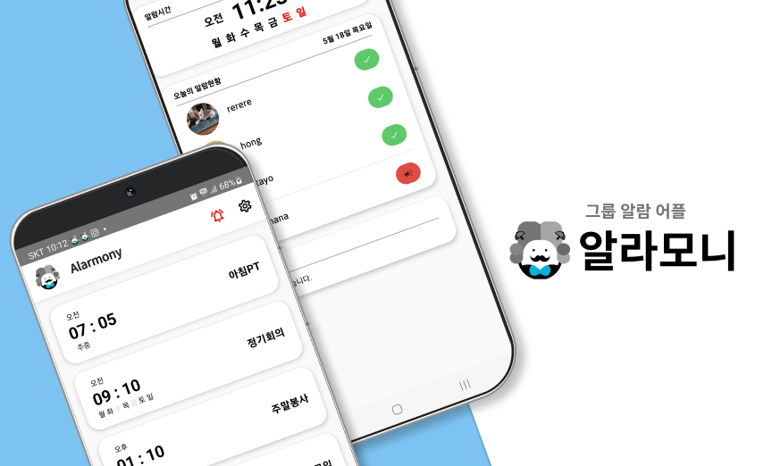
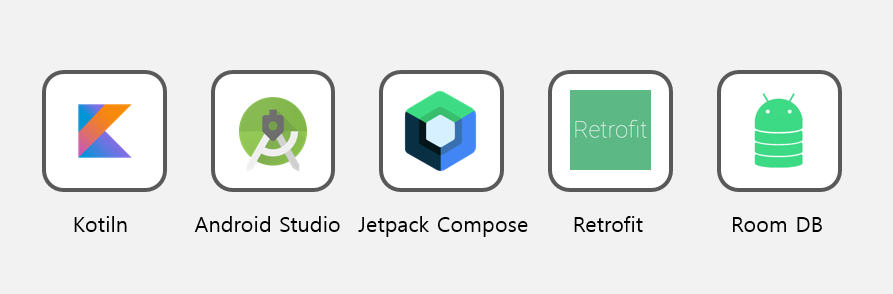
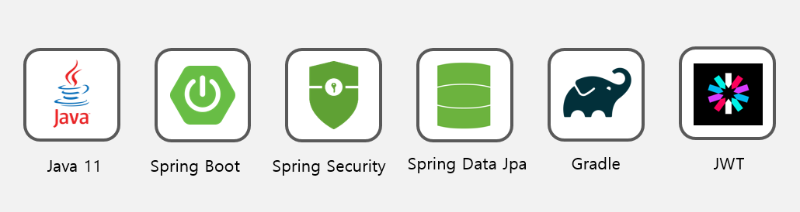
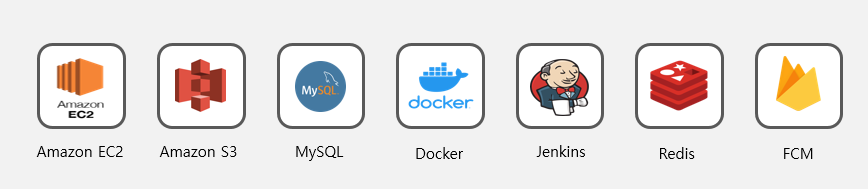
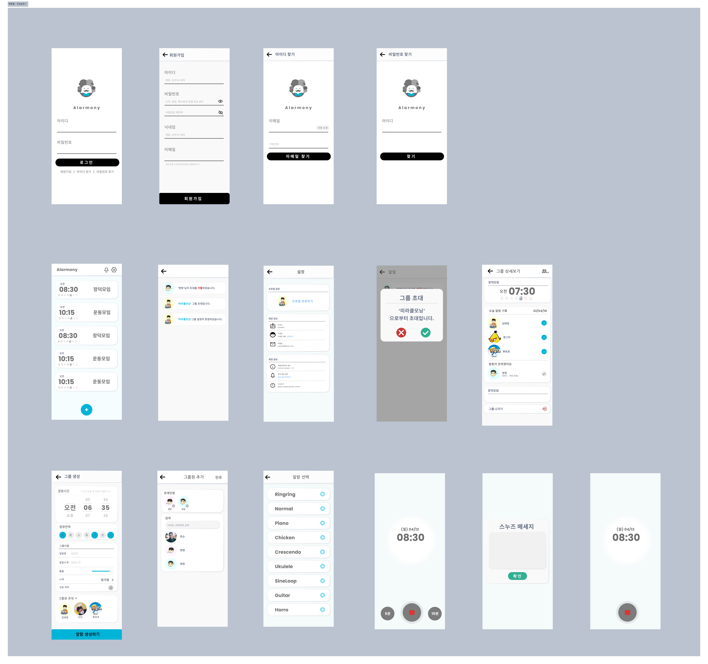
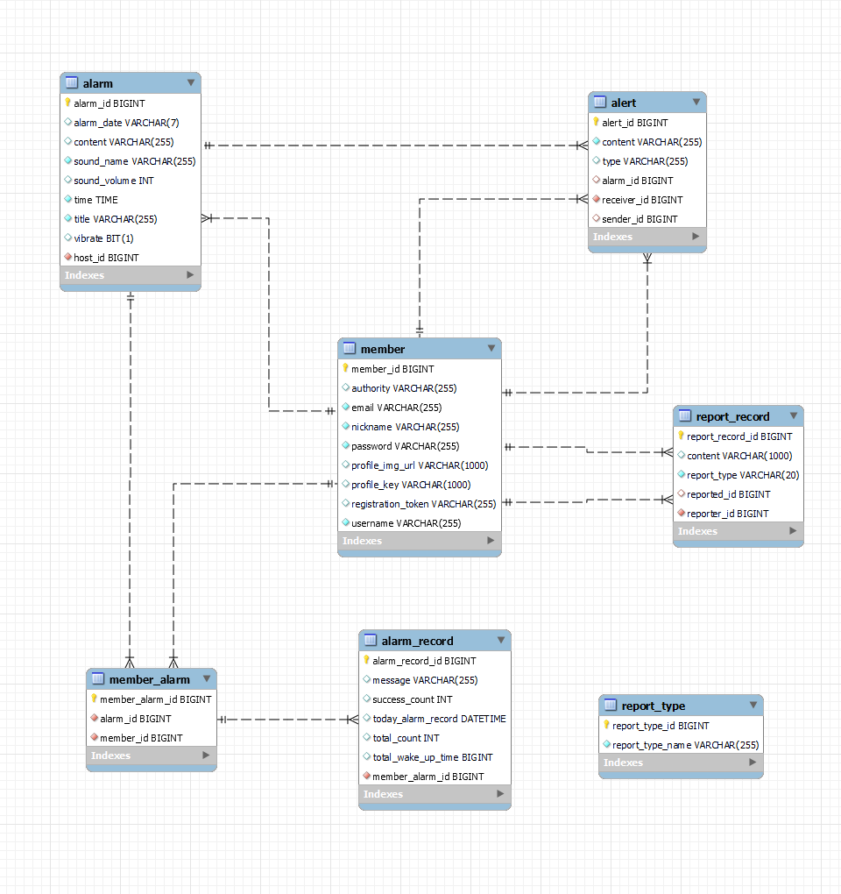

# ⏰그룹 알람 어플, 알라모니⏰

 

> 소개
> 

<aside>
📢 그룹 알람 애플리케이션 서비스 알라모니입니다.
혼자 확인하기 힘든 알람, 이제는 친구들과, 동료들과 함께 확인해 보세요!

</aside>

 자세한 화면 구성을 보고싶다면 아래 링크를 눌러주세요!

[서비스 화면](https://www.notion.so/6d8d844279074b61b9babec3e4a72b85)

> 개발기간 : 2023.03 ~ 2023.05 (약 7주)
> 

> 플레이스토어: [출시 예정]
> 

## 프로젝트 소개

### 서비스 개요

- 그룹에 소속하여 시간 관리/일정을 리마인드 시켜주는 공동 알람 시스템

### 주요 기능

- 개인 알람 설정 가능
- 그룹장이 설정 가능한 공유 알람
- 가입 유저를 닉네임 기반으로 검색 후 알람 그룹에 초대 가능

### 프로젝트의 특징

1. 그룹으로 알람 설정 기능
2. 일어나지 않은 사람에게 알람 보내기 기능
3. 서버에서 알람 정보가 관리되기 때문에 자유롭게 기기 간 알람 이동 가능
4. 중복 로그인시 자동 로그아웃 기능

## 🔧 **Tech Stacks**

### Android

 

| android | 13.0 |
| --- | --- |
| androidStudio | 2022.2.1 |
| kotlin | 222-1.8.0-release-AS3739.54 |
| compose | 1.3.2 |
| okhttp | 4.9.1 |
| Retrofit | 2.9.0 |
| Room DB | 2.4.3 |

### BackEnd

 

| Java | JDK - 11.0.17 |
| --- | --- |
| Spring Boot | 2.7.10 |
| Spring Security | 2.7.10 |
| Spring Data Jpa | 2.7.10 |
| IntelliJ | 2022.3.1 |
| Redis | 6.2.5 |
| Tympleaf | 3.0.15 |
| JWT | 0.11.5 |

### Infra

 

## 📐 **Infrastructure**

 

## 💻 피그마 설계

 

## 🔎 ERD 설계

 
