# EC2 접속 및 설정

EC2 환경에 접속하여 Docker를 설치합니다. Docker를 이용하여 Backend Server, Mysql, Redis, Jenkins를 컨테이너화 하여 실행시킵니다. 

</br>

## 원격 서버 접속 및 관리자 권한 접속 
</br>

- SSH (Secure Shell)을 사용하여 원격 서버에 연결하는 명령어 입니다.

```
ssh -i {SSH 키 파일} ubuntu(사용자이름)@{SSH로 연결하려는 서버의 주소}
```

- root계정의 암호를 변경

```
sudo passwd root
```

- 관리자 권한으로 접속

```
su
```
---
## Docker 설치 
</br>

 - 기본 위치를 설정

```
mkdir {사용할 폴더명}
cd {사용할 폴더명}
```

- Docker 설치하기

```
$ sudo apt-get update
$ sudo apt-get install \
	apt-transport-https \
	ca-certificates \
	curl \
	gnupg \
	lsb-release
$ curl -fsSL https://download.docker.com/linux/ubuntu/gpg | sudo gpg --dearmor -o /usr/share/keyrings/docker-archive-keyring.gpg
$ echo \
"deb [arch=amd64 signed-by=/usr/share/keyrings/docker-archive-keyring.gpg] https://download.docker.com/linux/ubuntu \
$(lsb_release -cs) stable" | sudo tee /etc/apt/sources.list.d/docker.list > /dev/null
$ sudo apt-get update
$ sudo apt-get install docker-ce docker-ce-cli containerd.io
```
---

## SSL 인증서 발급 (with letsencryp)
</br>


- HTTPS를 적용하기 위해 SSL 인증서를 발급받습니다.

```
$ sudo apt-get install letsencrypt
```

- letsencrypt를 설치한 후 해당 도메인에 ssl 인증서를 발급받아야 합니다.
- 해당 명령어를 입력후 .pem 키 발급이 완료됩니다. 발급된키는 `/etc/letsencrypt/live/{도메인}/` 에서 확인할 수 있습니다.

```
$ letsencrypt certonly --standalone -d {도메인}
```
---

## MySQL 설치
</br>


- 설치

```
docker run --name mysql-container -e MYSQL_ROOT_PASSWORD=<비밀번호> -d -p 3308:3308 mysql:8.0.30
```

- 계정 생성 및 권한 부여


```
//mysql 컨테이너 접속
docker exec -it mysql(컨테이너 이름) bash  

//MYSQL 로그인
mysql -uroot -p 

//새로운 사용자 생성
create user {계정명}@'%' identified by {비밀번호} 

//DB 생성
create database alarmony 

//alarmony 데이터 베이스에 대한 모든 권한을 {사용자}에게 부여
GRANT ALL privileges ON alarmony.* TO {계정명}; 
```

---

## Redis 설치 (JWT 관리)
</br>

- 설치 (주의: 비밀번호를  지정해주지 않으면 크롤러봇이 redis에 접근하여 데이터를 훼손시킬 수 있으므로 비밀번호를  반드시 지정합니다.)

```java
docker run -d -p 6379:6379 --name redis redis:6.2.5 --requirepass "{패스워드명}"
```


- Redis 접속하기

```java
docker exec -it redis(컨테이너 이름) bash
docker exec -it redis bash
redis-cli  //redis 접속
AUTH {비밀번호}

```
---  

## Jenkins 설치

</br>

- 설치

```

docker run --name jenkins -d -p 젠킨스접속포트번호:8080 -v /home/ubuntu/추가경로:/var/jenkins_home -v /var/run/docker.sock:/var/run/docker.sock -u root jenkins/jenkins:lts

docker start jenkins
```

---

## Jenkins 설정

- 접속하기

```
http://k8c205.p.ssafy.io:8000
```


- Jenkins 초기 비밀번호 입력

`docker logs {컨테이너명}` 로 접속후 사용되는 첫 비밀번호를 기입합니다.


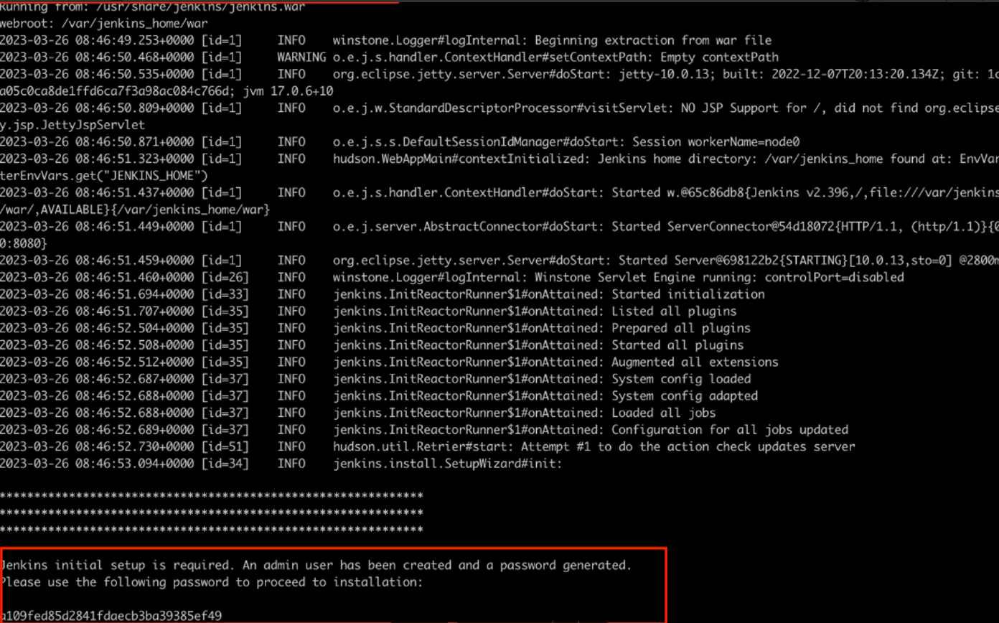 
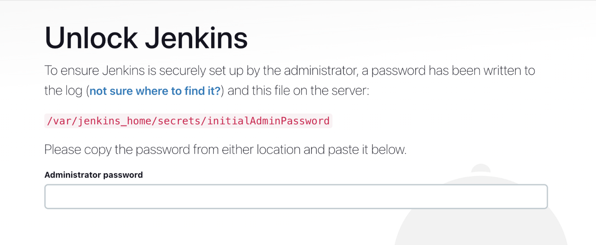 

- 계정 생성
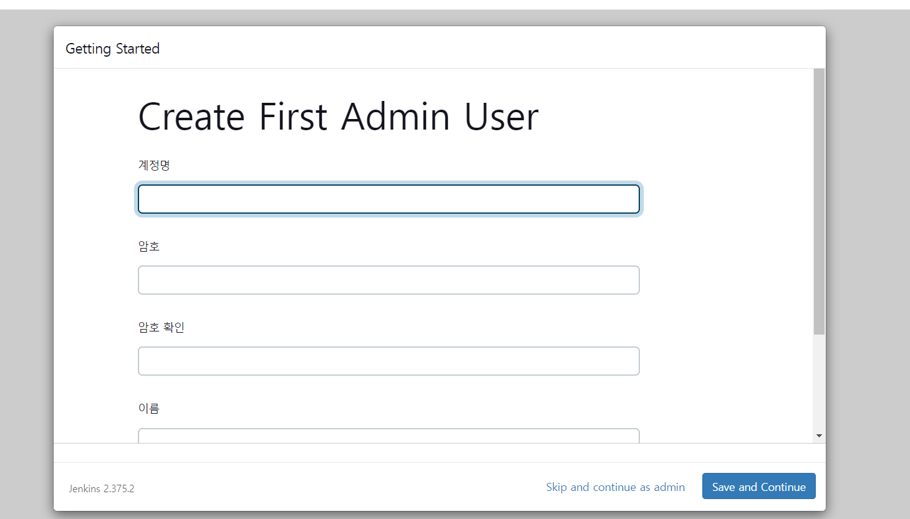 


- docker에서 제시하는 default설정으로 설치를 진행
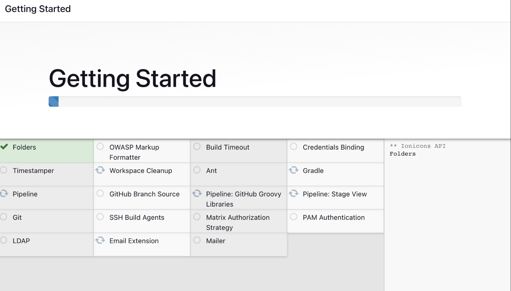 

- Jenkins 안에 Docker 설치 (Jenkins 파이프라인 작성시에 Docker명령어를 사용하기 때문입니다.)


```
//Jenkins 접속
docker exec -it jenkins bash

//Jenkis안에 Docker 설치하기//Jenkins 안에 Docker 설치
apt-get install \
    ca-certificates \
    curl \
    gnupg \
    lsb-release
mkdir -p /etc/apt/keyrings
curl -fsSL https://download.docker.com/linux/debian/gpg | gpg --dearmor -o /etc/apt/keyrings/docker.gpg
echo \
  "deb [arch=$(dpkg --print-architecture) signed-by=/etc/apt/keyrings/docker.gpg] https://download.docker.com/linux/debian \
  $(lsb_release -cs) stable" | tee /etc/apt/sources.list.d/docker.list > /dev/null
## - Install Docker Engine
apt-get update
apt-get install docker-ce docker-ce-cli containerd.io docker-compose-plugin
```

### Git Lab + Jenkins Webhook 연동하기

- Git lab Project Acess Token 발급
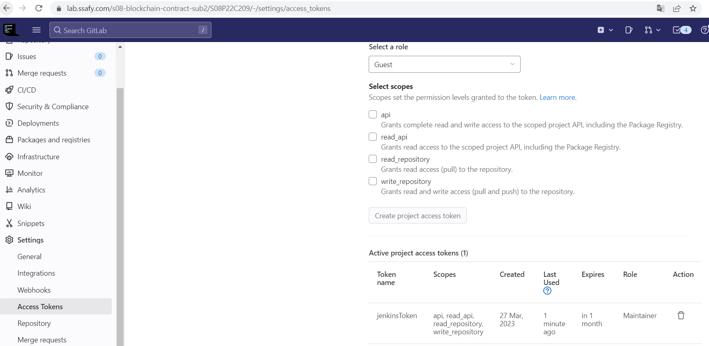 


```
프로젝트 → Setting → Access Token으로 이동 후 Token 발급
```


- Jenkins Gitlab 설정하기

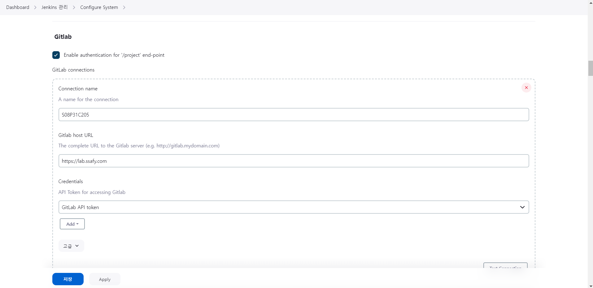 

```
 Dashboard → Jenkins 관리 > System 들어가서 Gitlab 설정 

Gitlab Project Access Token 값을 가지고 Gitlab Connections를 설정합니다.

- `Connection name` : Connection name으로 사용할 이름을 정해줍니다.
- `Gitlab host URL` : Gitlab host URL을 작성합니다. 예시와 같이 하시면 됩니다.
- `Credentials` : Add 버튼을 눌러 Gitlab과 acessing할 API Token 값을 넣어줍니다.
```

Add 버튼을 클릭하여  `Credentials`  를 등록합니다.

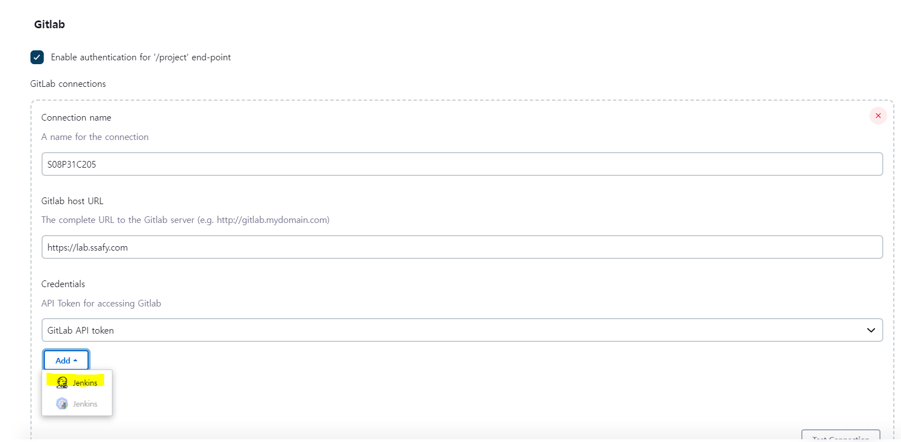 

Add를 누르면 다음과 같이 나온다.

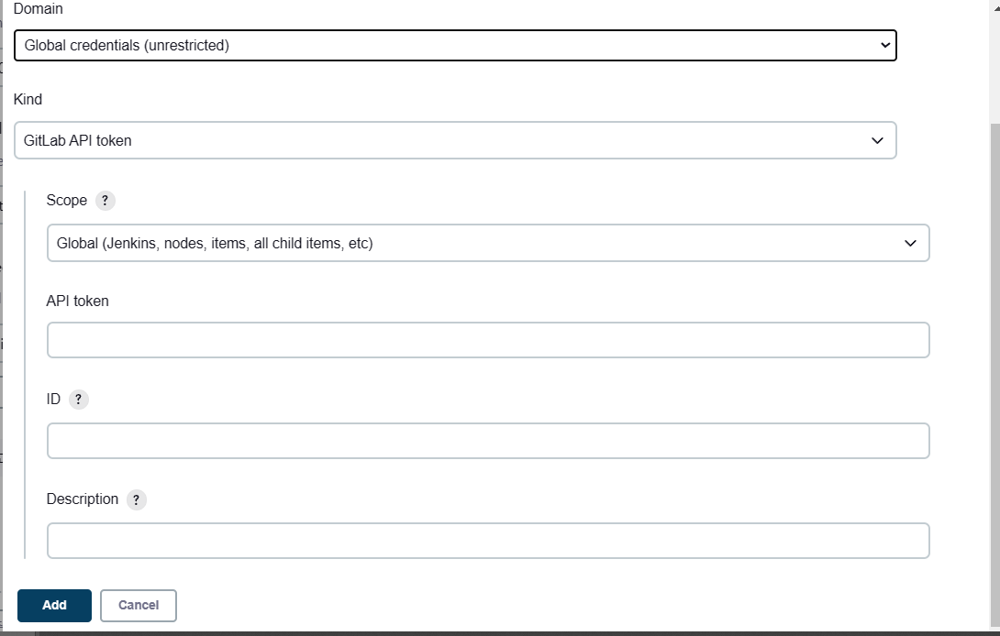 

```

- `API token` : Gitlab에서 발급한 API token 값을 넣습니다.
- `ID` :  이 보안설정값의 이름을 부여합니다.
- `Description` : 설명란 입니다.
```

### 이후 TestConnection을 눌러 테스트

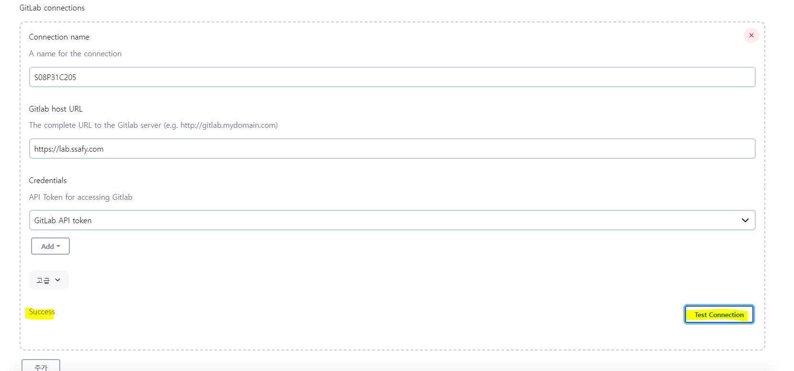 

```
`Success` 문구가 떴다면 정상적으로 연동이 되었다는 것을 의미합니다.
```

### Gitlab WebHook  연결

<aside>
📢 여기서는  Pipline을 선택하여 연동해보겠습니다.

Enter an item name에는 사용할 이름을 적어줍니다.

</aside>

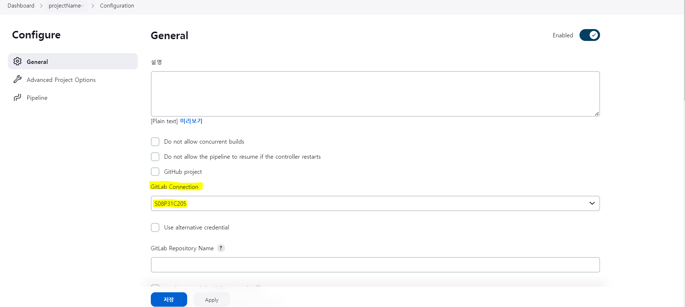 

<aside>
📢 생성 후에 다음 페이지로 넘어가서 설정하여 봅시다.

현재 GitLab Connetion을 보면 앞서서 Dashboard → Jenkins 관리 > System 들어가서 Gitlab 설정을 했기 때문에 자동으로 해당  설정한 Connection으로 바로 연결이 됩니다

</aside>

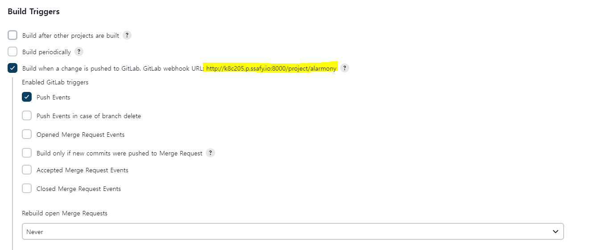 
- Build Triggers 설정

<aside>
📢 Build Triggers(빌드 트리거) 설정은 젠킨스에서 빌드 작업이 자동으로 시작되는 조건을 설정하는 기능입니다. 이 설정을 통해 특정 이벤트가 발생했을 때 빌드가 자동으로 실행되도록 할 수 있습니

</aside>
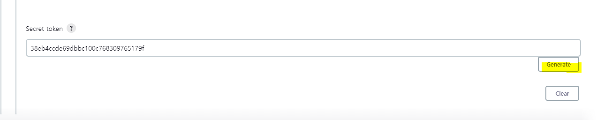 

<aside>
📢 **`Build when a change is pushed to GitLab. GitLab webhook URL: [http://k8c205.p.ssafy.io:8000/project/{item이름}](http://j8c209.p.ssafy.io:8080/project/{item이름})`**

- 이는 변경 사항이 GitLab에 푸시될 때 빌드는 연결된 GitLab 리포지토리에 새로운 커밋이나 변경 사항이 푸시될 때마다 Jenkins가 자동으로 빌드를 트리거해야 함을 의미합니다.
- 제공된 GitLab 웹후크 URL "[http://k8c205.p.ssafy.io:8000/project/{itemname}](http://j8c209.p.ssafy.io:8080/project/%7Bitemname%7D)
 "는 GitLab이 Jenkins에게 새 이벤트를 알리는 데 사용할 URL입니다. 따라서 이 값을  Gitlab WebHook을 만들어 줄 때 사용하겠습니다.
- Enabled GitLab triggers 에 `Push Events` 가 발생했을 때 트리거가 발생하도록 선택하여 줍니다.
</aside>

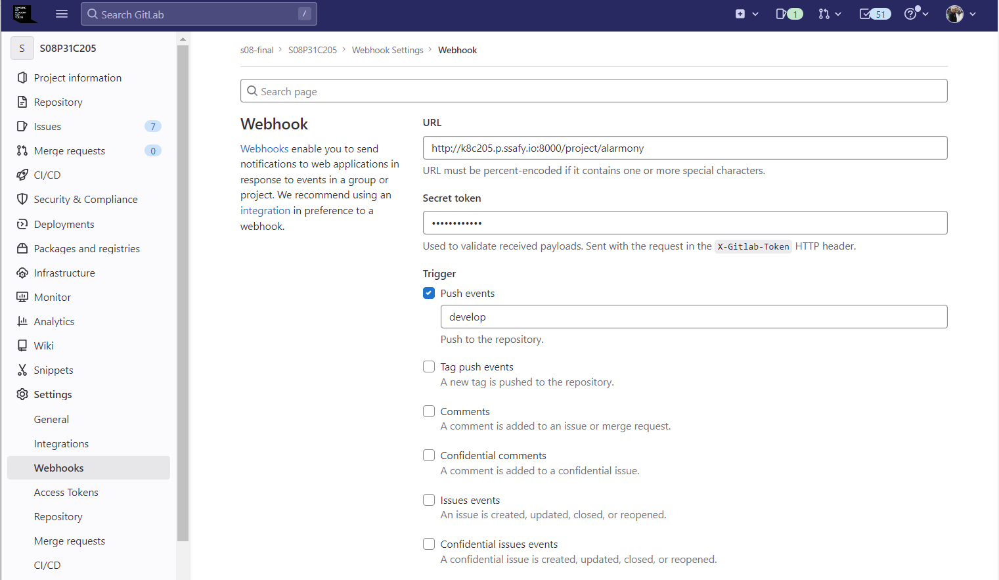 

<aside>
📢 Secret Token : 처음에 들어오셨다면 이 칸은 빈값입니다. Generate를 눌러 토큰을 발급 받습니다. 이 값 또한 Gitlab의 Webhook 을 연결할때 사용합니다.

</aside>

- GitLab WebHook 설정

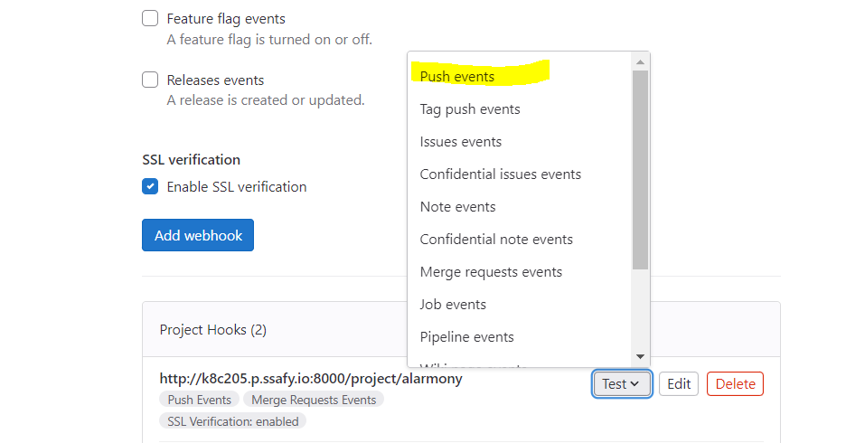 

<aside>
📢 Gitlab  WebHook을 걸고 싶은 프로젝트에 들어가 Settings→Webhooks을 클릭합니다.
누르면 해당 화면이 나오게 되는데요 

`**URL**` : 위의 Jenkins  **`Build when a change is pushed to GitLab. GitLab webhook URL: [http://j8c209.p.ssafy.io:8080/project/{item이름}](http://j8c209.p.ssafy.io:8080/project/{item이름})`  의 URL을 입력합니다.

`Secret Token` :** Jenkins에서 발급한 Secret Token 값을 입력합니다. 

Push events: 체크표시합니다. 트리거할 브랜치 이름 또는 와일드카드 패턴( 혹은 모두 비워두기)을 적습니다. 변경 사항이 Git 리포지토리로 푸시될 때 작업 빌드를 트리거해야 하는 브랜치를 지정하기 위해 Jenkins 작업 구성에서 사용되는 필드입니다.

예를 들어 develop이라는 브랜치에만 트리거를 하고 싶다면 develop만 적습니다. 
feature/*"와 같이 여러 분기를 일치시켜 "feature/"로 시작하는 모든 분기를 일치시킬 수 있습니다

</aside>


<aside>
💡 Add webhook을 하고 Test를 해봅니다. Test버튼의 Push events를 클릭하여 해당 이벤트가 잘 발생하는지 확인하도록 합시다. 정상적으로 동작하였다면 상단에 Hook excuted successfully:HTTP 200 메세지를 확인할 수 있습니다.

</aside>

- PipeLine 작성

```
pipeline {
    agent any
    
    // 환경 변수
    environment {
        PROJECT = 'backend' // 'PROJECT' 환경 변수를 'backend'으로 설정
    }
    
    stages {
        stage('github clone') {
            steps {
                // 지정된 URL과 브랜치에서 Git 리포지토리를 클론합니다.
                git branch: 'develop',
                    credentialsId: 'alarmony', // Git 리포지토리에 접근하기 위한 자격 증명
                    url: 'https://lab.ssafy.com/s08-final/S08P31C205'
            }
        }
        
        stage('Build') {
            steps {
                dir('backend/src/main/resources') {
                    // Jenkins 홈 디렉토리에서 필요한 파일을 리소스 디렉토리로 복사합니다.
                    sh 'cp /var/jenkins_home/initfile/application.yml ./application.yml'
                    sh 'cp /var/jenkins_home/initfile/fcm-alert-config.json ./fcm-alert-config.json'
                }
                dir('backend/src/main/resources/ssl') {
                    // Jenkins 홈 디렉토리에서 keystore.p12 파일을 ssl 디렉토리로 복사합니다.
                    sh 'cp /var/jenkins_home/initfile/keystore.p12 ./keystore.p12'
                }
                dir('backend') {
                    // backend를 위한 Docker 이미지를 빌드합니다.
                    sh 'docker build -t backend .'
                }
            }
        }
        
        stage('Deploy') {
            steps {
                // 기존의 'backend' Docker 컨테이너를 중지하고 제거합니다 (존재할 경우).
                sh 'docker stop backend || true && docker rm backend || true'
                
                // 새로운 'backend' Docker 컨테이너를 실행합니다.
                sh 'docker run -d -p 443:443 --network c205 --name backend backend'
            }
        }
    }
    
    post {
        success {
            // 성공적인 빌드에 대한 Mattermost 채널로 성공 알림을 보냅니다.
            mattermostSend (color: 'good', 
                message: "빌드 성공!! (${env.JOB_NAME}) #(${env.BUILD_NUMBER}) (<${env.BUILD_URL}|Open>) \n See the (<${env.BUILD_URL}console|console>)", 
                endpoint: 'https://meeting.ssafy.com/hooks/dm3pf61zab815fpa6rxsi63k1r')
        }
        failure {
            // 실패한 빌드에 대한 Mattermost 채널로 실패 알림을 보냅니다.
            mattermostSend (color: 'danger', 
                message: "빌드 실패.. (${env.JOB_NAME}) #(${env.BUILD_NUMBER}) (<${env.BUILD_URL}|Open>) \n See the (<${env.BUILD_URL}console|console>)", 
                endpoint: 'https://meeting.ssafy.com/hooks/dm3pf61zab815fpa6rxsi63k1r')
        }
    }
}
```
