# 개발환경

| 이름 | 버전 |
| --- | --- |
| kotlin | 1.7.20 |
| Retrofit2 | 2.9.0 |
| Jetpack compose | lates |
| Room | 2.4.3 |
| coroutine | 1.6.1 |


# Android

## 안드로이드 기본 설정

### 안드로이드 스튜디오 설치

[Android 개발자  |  Android Developers](https://developer.android.com/?hl=ko)

### 공식홈페이지에서 스튜디오 다운로드 페이지 이동

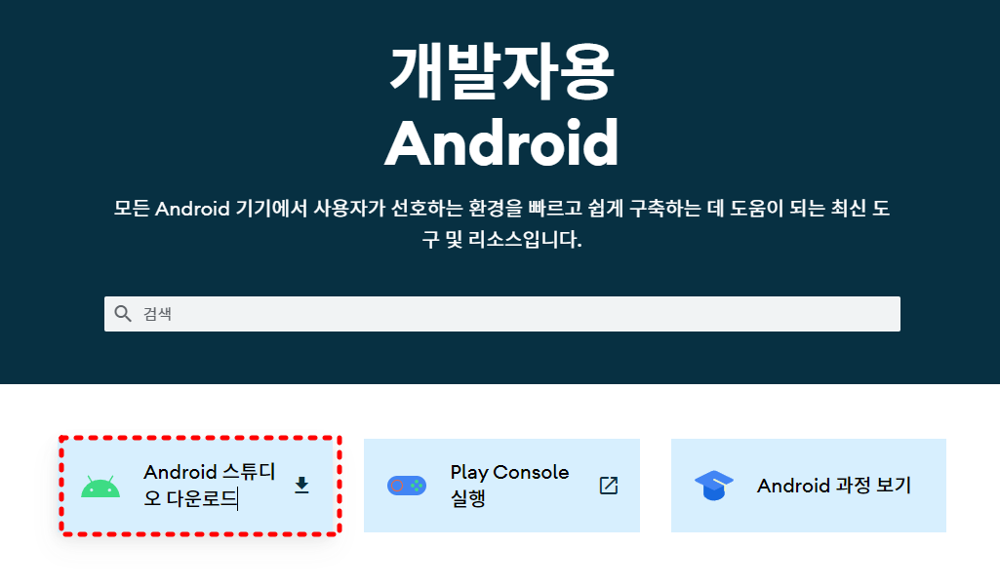 

### 공식 홈페이지에서 제공하는 exe파일 다운로드

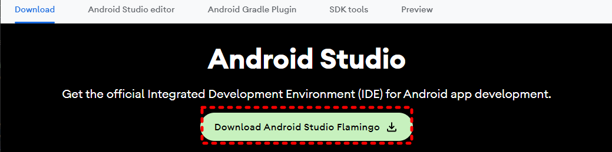 
### exe파일 실행

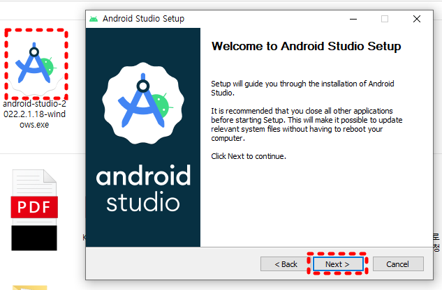 

### 순서대로 체크해서 실행

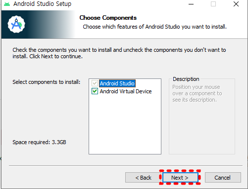 

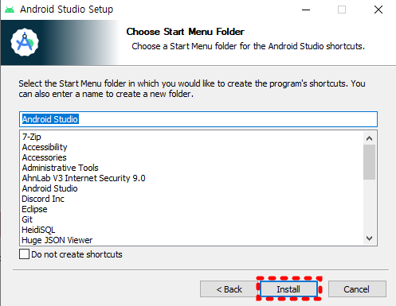 

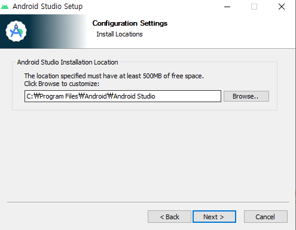 

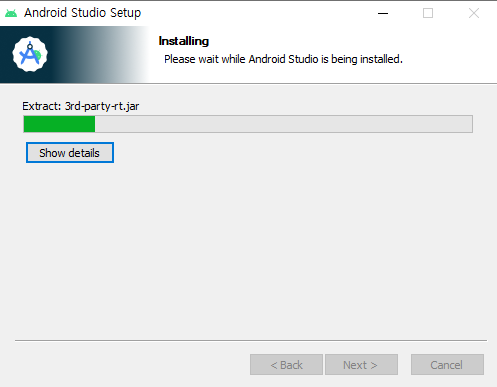 

### 모든 항목을 완료

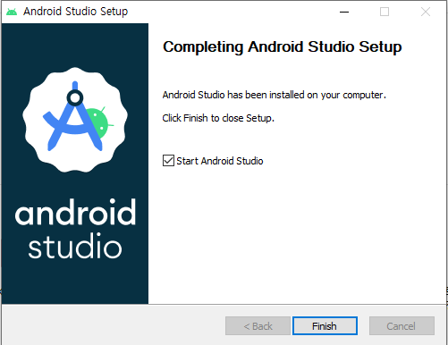 

---

### 안드로이드 기본 프로젝트 설치

## Retrofit 설정

---

### GSON 의존성 추가

```kotlin
implementation 'com.google.code.gson:gson:2.8.6'
```

### Retrofit 관련 의존성 추가

```kotlin
// Gson
implementation 'com.google.code.gson:gson:${gson_version}'
// Retrofit
implementation 'com.squareup.retrofit2:retrofit:${retrofit_version}'
implementation 'com.squareup.retrofit2:converter-gson:${version}'
// OkHttp
implementation 'com.squareup.okhttp3:okhttp:${version}'
implementation 'com.squareup.okhttp3:logging-interceptor:${version}'
```

의존성을 추가해주세요.!!

### 권한 설정 ( AndroidMainfest에 인터넷 관련 권한 )

```kotlin
<uses-permission android:name="android.permission.INTERNET"/>
```

HTTP 통신을 하려면 기본적으로 인터넷을 이용해야 하므로 AndroidMainfest에 인터넷 관련 권한을 추가

### 생성 절차

1. 결과값 맵핑
받아온 데이터를 객체와 맵핑하기 위해서 @SerializedName 어노테이션을 사용
2. API 인터페이스 설정
    
    ```groovy
    @Header 어노테이션을 사용하면 Request Header에 담아줄 데이터를 넣어줄 수 있습니다.
    
    @POST , @GET, @PUT, @DELETE : RestAPI를 설정해주시면 됩니다.
    
    - 만약 POST방식으로 Body에 데이터를 삽입하려면 
    	변수 앞에 @Body 어노테이션을 붙여주세요.
    - 객체가 아닌 단일로 설정해주려면 @Field 어노테이션을 사용해주세요.
        ex) @Field(”멤버명”) username : String?
        
    
    Call은 흐름 처리 기능을 제공하는 retrofit2 패키지 안에 있는 interface ( Call<T> )
    ```
    
3. Retrofit 객체를 구현
4. RestAPI 설정을 해준 인터페이스를 추가 및 Retrofit 객체 생성
    
    ```kotlin
    val memberApi = retrofit.create(MemberRepository::class.java)
    ```
    

---

## Room Database 설정

### 앱에서 Room을 사용하기 위해 build.gradle에 종속 항목 추가

- annotationProcessor는 코틀린에서 kapt 컴파일러 플러그인과 함께 사용하도록 되어있으므로 gradle의 맨 앞 부분에 플러그인 추가

```kotlin
plugins {
    id 'kotlin-kapt'
}

dependencies {
  def room_version = "2.2.6"

  implementation "androidx.room:room-runtime:$room_version"
  kapt "androidx.room:room-compiler:$room_version"

  implementation "androidx.room:room-ktx:$room_version"
}
```

- 엔터티 클래스 확인 ( @Entity 어노테이션 작성 _)
- 데이터 액세스 개체 확인
    
    ```groovy
    - 인터페이스로 작성
    - @Dao 어노테이션 작성
    - Query 어노테이션은 사용자 지정 쿼리를 작성하는 데 사용
    - 함수를 suspend로 표시하여 코루틴 내에서 호출 가능
    ```
    
- 데이터베이스 클래스
    
    ```groovy
    - RoomDatabase를 확장하는 추상 클래스 작성
    - @Database 어노테이션 작성
        - 동기화된 메서드를 입력하는 스레드는 잠금을 가져오며, 잠금이 해제될 때까지 다른 스레드는 메서드에 들어갈 수 없음
        - @**Synchronized 어노테이션과 동일한 기능 제공**
    ```
    
- 저장소 클래스
    
    ```groovy
    - AlarmDatabaseDao를 생성자 매개 변수로 사용하는 리포지토리 클래스 작성
    - 데이터베이스에 대한 모든 상호 작용은 이 저장소 계층을 통해 수행
    ```
    

---

# Android 및 서버 FCM 설정

## Firebase 설정

- 프로젝트 생성
    1. 아래 사이트에서 Firebase 프로젝트를 생성한다.
        
        [](https://console.firebase.google.com/)
        
    2. 프로젝트 생성
        
      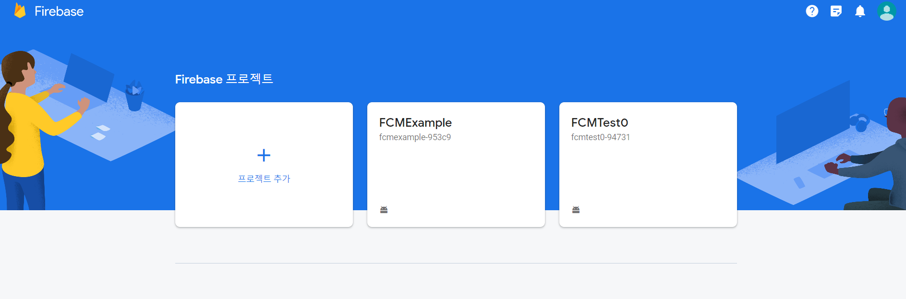 
        
       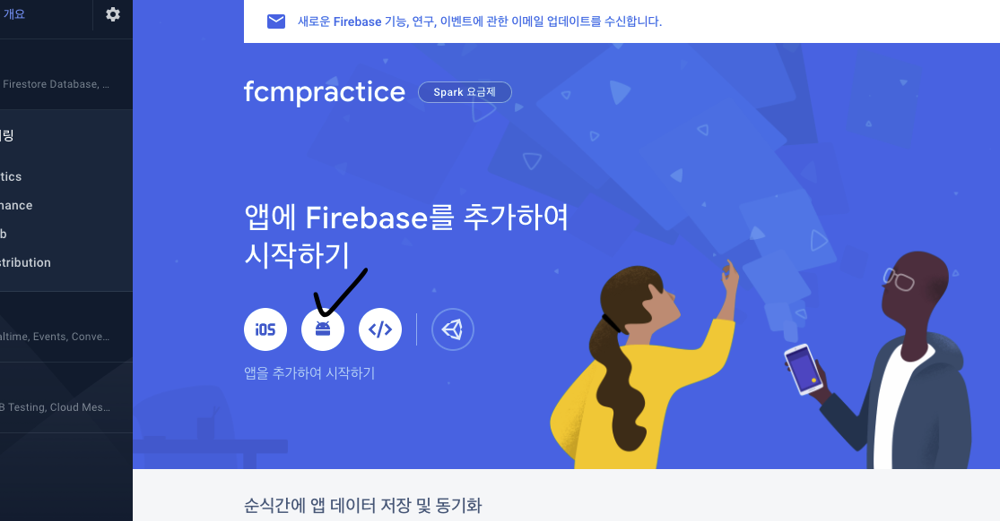 
        
        안드로이드를 선택한다
        
      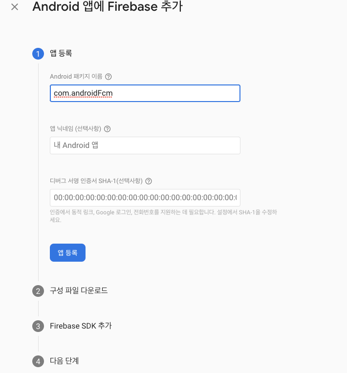 
        
        패키지 이름과, 앱 닉네임을 설정한다.
        
    
    ### 안드로이드 프로젝트에 넣을 세팅 파일
    
   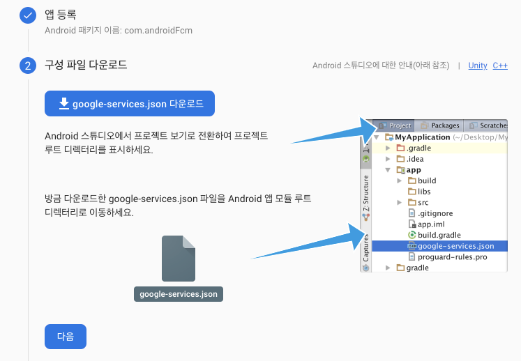 
    
    google-service.json 파일을 다운받고, 안드로이드에 넣어주어야 한다.
    
  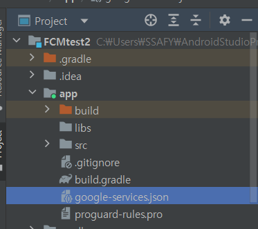 
    
    해당 위치에 넣고, 다시 빌드해야 한다.
    
    ### 웹 서버에 넣을 세팅 파일
    
    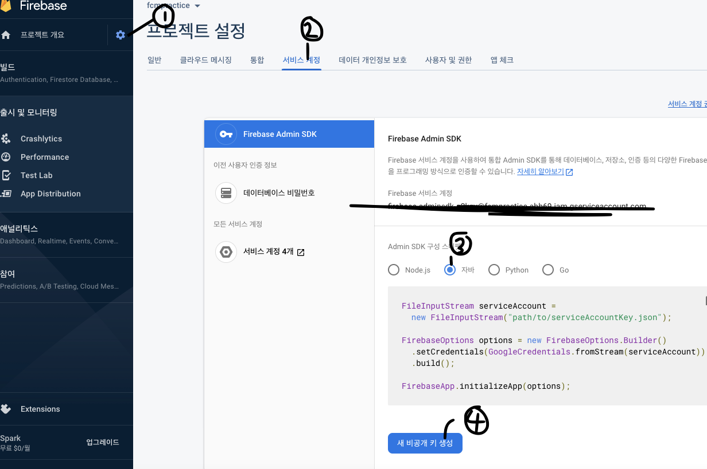 
    
    json 파일을 받고, 웹 서버에 저장한다.
    
   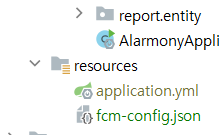 
    
    저장 경로와 파일이름은 상관이 없으나, 나중에 쉽게 찾아서 쓸 경로로 두는 편이 좋다.
    

## 안드로이드 세팅

### build.gradle (Project)

```
dependencies{
	classpath 'com.google.gms:google-services:4.3.15'
}
```

### build.gradle (Module)

```
dependencies{
	implementation 'com.google.firebase:firebase-messaging:21.1.0'
}
...
apply plugin: 'com.google.gms.google-services'
```

### AndroidManifest.xml

```xml
...
// Internet permission 추가
<uses-permission android:name="android.permission.INTERNET"/>

// service추가 및 intent필터 추가
<application>
	<!--   서비스를 추가하고 인텐트 필터를 설정한다.   -->
  <service android:name=".MyFirebaseMessagingService"
      android:exported="true">
      <intent-filter>
          <action android:name="com.google.firebase.MESSAGING_EVENT"/>
      </intent-filter>
  </service>
...
</application>
```

### MyFirebaseMessagingService

```java
@Override
public void onNewToken(@NonNull String token) {
    super.onNewToken(token);
    //token을 서버로 전송
}

@Override
  public void onMessageReceived(@NonNull RemoteMessage remoteMessage) {
      super.onMessageReceived(remoteMessage);
      //수신한 메시지를 처리
			//알림 처리 예시는 아래 토글 참조
}
```

## Java 세팅

### Build.gradle

```java
dependencies{
	...
	implementation group: 'com.squareup.okhttp3', name: 'okhttp', version: '4.2.2'
	implementation 'com.google.firebase:firebase-admin:9.1.1'
	...
}
```

### FCMService.java

- 코드는 예시이다. 버전과 상황에 맞게 수정해야 한다.

### getAccessToken

```java
public String getAccessToken() throws IOException {
        // firebase로 부터 access token을 가져온다.

        GoogleCredentials googleCredentials = GoogleCredentials
                .fromStream(new ClassPathResource("fcm-config.json").getInputStream())
                .createScoped(Arrays.asList("https://www.googleapis.com/auth/cloud-platform"));

        googleCredentials.refreshIfExpired();

        return googleCredentials.getAccessToken().getTokenValue();

    }
```

### SendMessageTo

```java
public void sendMessageTo(String targetToken, String title, String body) throws IOException {
        String message = makeMessage(targetToken, title, body);
        log.info("Bearer " + targetToken);
        OkHttpClient client = new OkHttpClient();
        RequestBody requestBody = RequestBody.create(message,
                MediaType.get("application/json; charset=utf-8"));
        Request request = new Request.Builder()
                .url(urlInfo.getFcmApi())
                .post(requestBody)
                .addHeader(HttpHeaders.AUTHORIZATION, "Bearer " + getAccessToken())
                .addHeader(HttpHeaders.CONTENT_TYPE, "application/json; UTF-8")
                .build();

        log.info("Bearer " + getAccessToken());
        Response response = client.newCall(request).execute();

        System.out.println(response.body().string());
    }
```

### makeMessage

```java
public String makeMessage(String targetToken, String title, String body) throws JsonParseException, JsonProcessingException {
        FcmMessage fcmMessage = FcmMessage.builder()
                .message(FcmMessage.Message.builder()
                        .token(targetToken)
                        .notification(FcmMessage.Notification.builder()
                                .title(title)
                                .body(body)
                                .image(null)
                                .build()
                        ).build()).validateOnly(false).build();

        return objectMapper.writeValueAsString(fcmMessage);
    }
```